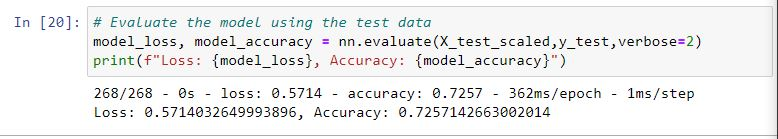

# neural_network_charity_analysis

## Overview

### Purpose

The purpose of this analysis is to build a neural network model in order to determine which organizations have been successful after receiving money from Alphabet Soup Charity based on a variety of parameters.

## Results

### Data Preprocessing

* The target variable from this dataset is contained in the IS_SUCCESSFUL column
* The features relevant to the model are 'APPLICATION_TYPE', 'AFFILIATION', 'CLASSIFICATION', 'USE_CASE', 'ORGANIZATION', 'INCOME_AMT', 'SPECIAL_CONSIDERATIONS', 'ASK_AMT'.  'APPLICATION_TYPE' and 'CLASSIFICATION' were binned in order to prevent outliers from hindering model-fitting.
* "EIN" AND "NAME" are irrelevant to the model and are not included as features

### Model Building

* For the first attempt at model fitting, 2 hidden layers were utilized, the first of which containing 80 neurons and the second containing 30 neurons, both with a "relu" activation function. Eighty neurons were selected for the first layer in order to get a number approximateyl 2 times the number of elements present in the preprocessed DataFrame.  The 30 neurons selected for the second layer were chosen as a step down in total neuron count from the first layer.
* The model was only able to achieve an accuracy of 0.7257, which is below the desired model accuracy of 0.75

* Optimizations
    * In order to improve accuracy, the first attempt added a third hidden layer with 10 neurons.  This resulted in an accuracy score of 0.7227, a worse result than the original.

    * The second attempt at optimization reduced the neuron count in the first layer to 50 and changed the activation function for the first layer to "tanh".  This resulted in an accuracy score of 0.7239, again lower than the original

    * In the third attempt, the Keras Tuner was employed to attempt to iterate through several potential options with the hopes or reaching the desired 0.75 accuracy.
        * The tuner was set to include a maximum of 80 neurons in the first layer with a minimum of 4 neurons and a step-value of 4 neurons.
        * The  potential 1 through 6 extra hidden layers had a maximum of 60 neurons in the first layer with a minimum of 4 neurons and a step-value of 4 neurons.
        * The tuner was set to cycle through 100 epochs per attempt.
    * The best optimized model reached an accuracy of 0.7294.  While this is an improvement over the first attempt, it did not reach the desired result of 0.75 or more.

## Summary

Overall, the best classification model developed yielded a result of 0.7294.  However, given the number of layers and neurons per layer this model did not reach the desired accuracy of at least 0.75 and also is likely to have been overfitted for this dataset.  Some of the data inputs also had rather extreme variation, suggesting that there may be perhaps a better way to approach building a model for classifying this data.  In particular, the job may be better served by a Random Forest Classifier since Random Forest Classifiers can easily handle outliers and nonlinear data while being able to execute much, much faster than the deep learning attempts pursued for this analysis.  A Random Forest Classifier would be expected to arrive at a similar result for this analysis in a matter of seconds rather than the 2 hours spent using the keras tuner.

